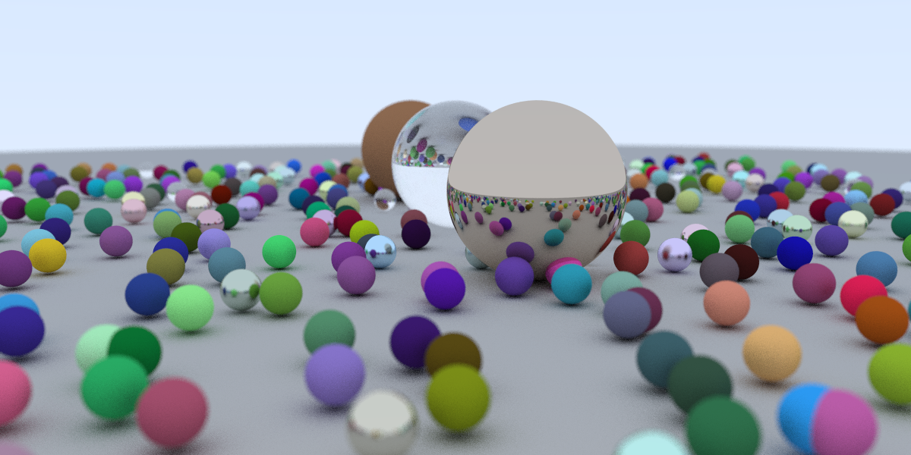

# CUDA Raytracing

This is a CUDA-based raytracer following [Peter Shirley's Raytracing in one Weekend series](https://raytracing.github.io/)
but using CUDA kernels instead of CPU-based computation.


> Progress after finishing the first book

## Requirements

- GPU with compute capability 7.5 or higher
- C++20 compatible compiler
- vcpkg (for fmt)

## Building

> Tested with an NVIDIA RTX 4070 and CUDA Toolkit 13.3

First configure the CMake project with

```bash
cmake --preset gcc-debug
```

and then build the project with

```bash
cmake --build --preset gcc-debug
```

> Alternatively, the ```debug``` suffix can be replaced with ```release``` for faster execution time.
